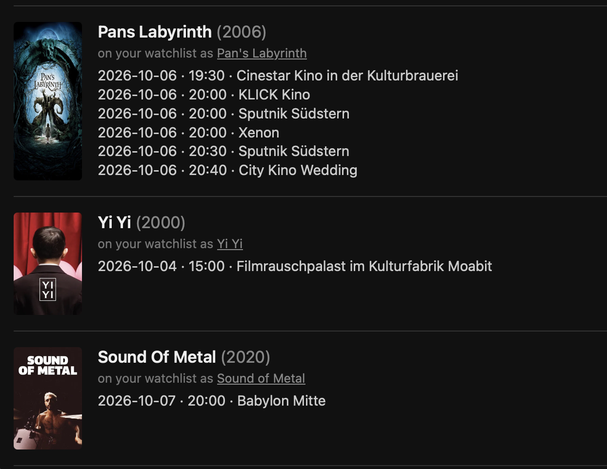

# Berlin Rerelease Finder

Finds films currently screening in Berlin (OV/OmU) that are also on your
Letterboxd watchlist and older than 6 months. See [CONCEPT.md](CONCEPT.md)
for the full plan and reasoning.



## How it works

- Cinema listings come from [ovberlin.online](https://ovberlin.online)
  (via the [berlin-cinema](https://github.com/santistebanc/berlin-cinema)
  project), which itself aggregates critic.de and berlin.de. This project
  doesn't scrape cinema sites directly — it just fetches that published feed.
- Your watchlist is scraped directly from your public Letterboxd watchlist
  page.

Both are third-party sources outside this project's control; if either
changes its format or blocks requests, fetching may break.

## Requirements

- Python 3.11+ (tested on 3.14)
- Your own Letterboxd account, with its watchlist set to public (Letterboxd
  Settings → Privacy → "Your Watchlist" → visible to anyone). This app reads
  it directly from `https://letterboxd.com/<your-username>/watchlist/`, so it
  needs to be viewable without logging in.

## Run it

```
git clone <this-repo-url>
cd cinema_oldmovies
python3 -m venv .venv
source .venv/bin/activate
pip install -r requirements.txt
export LETTERBOXD_USERNAME=your_letterboxd_username  # from your profile URL: letterboxd.com/<username>/
cd backend
python3 app.py
```

Then open http://127.0.0.1:5001

Alternatively, run `python3 launch.py` instead of `app.py` to open the app
in its own native window (via `pywebview`) instead of a browser tab. Closing
the window stops the server.

## Standalone scripts (useful for debugging without the webapp)

- `python3 backend/fetch_cinema.py` — fetch + cache current Berlin OV/OmU listings
- `python3 backend/fetch_watchlist.py` — scrape your Letterboxd watchlist
- `python3 backend/match.py` — run the full pipeline and print matches to the terminal
